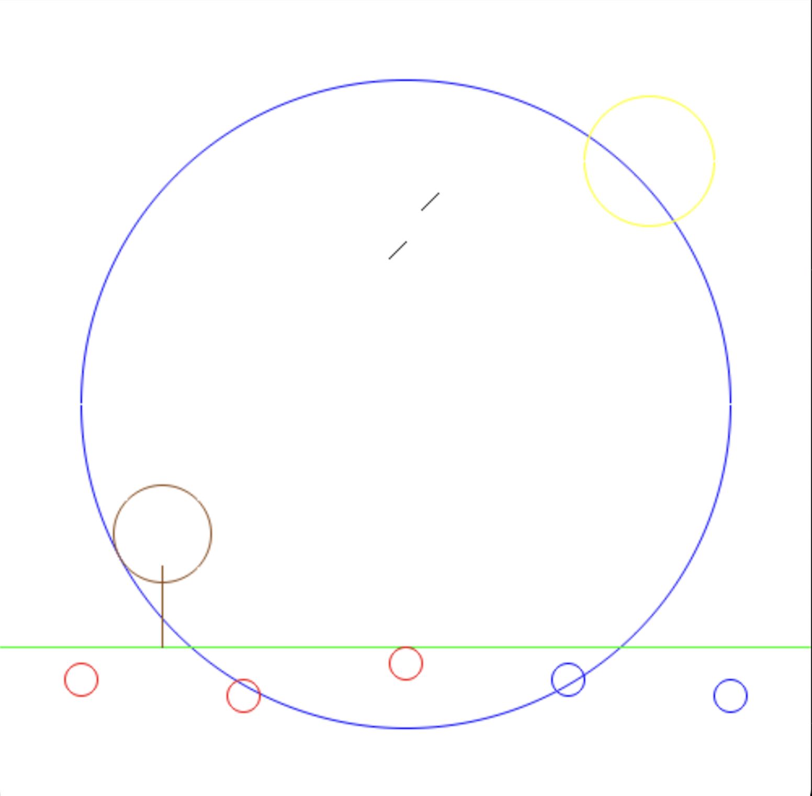

# Neuro's Canvas

This is a basic painting app built in Pygame that allows [Neuro-sama](https://www.bloomberg.com/news/newsletters/2023-06-16/neuro-sama-an-ai-twitch-influencer-plays-minecraft-sings-karaoke-loves-art) to draw. It uses the [Python SDK](https://github.com/CoolCat467/Neuro-API) of the [Neuro API](https://github.com/VedalAI/neuro-game-sdk).

A "landscape" drawn by Jippity using this app.

## Installation
`pip install neuro-canvas`

## Usage
`neuro-canvas`

## Contributing
Feature suggestions and pull requests are welcome!